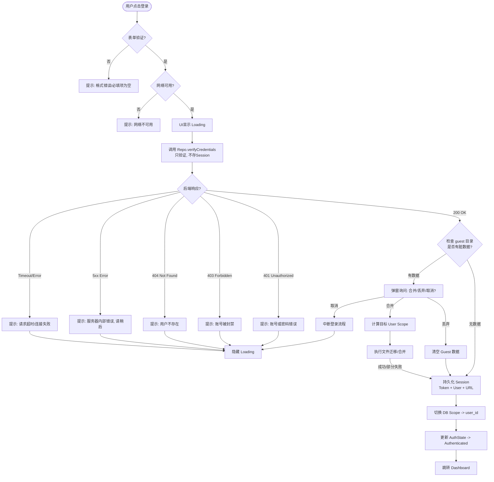
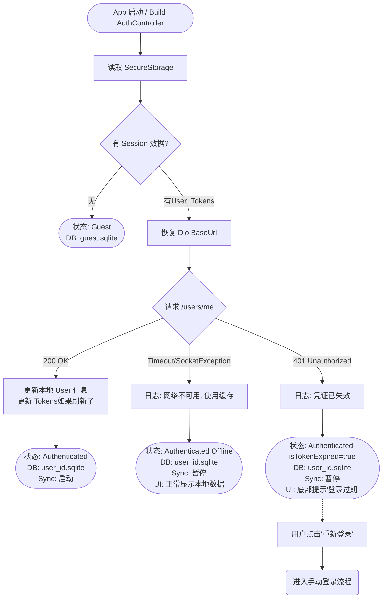

# user

```mermaid
flowchart TD
    Start([用户点击登录]) --> FormValid{表单验证?}
%% 1. 本地校验异常
    FormValid -- 否 --> UI_Error_Form[提示: 格式错误/必填项为空]
    FormValid -- 是 --> NetCheck{网络可用?}
%% 2. 网络环境异常
    NetCheck -- 否 --> UI_Error_Net[提示: 网络不可用]
    NetCheck -- 是 --> Loading[UI显示 Loading]
    Loading --> Req_Verify[调用 Repo.verifyCredentials\n 只验证, 不存Session]
    Req_Verify --> ServerCall{后端响应?}
%% 3. 服务端异常处理
    ServerCall -- 401 Unauthorized --> UI_Error_401[提示: 账号或密码错误]
    ServerCall -- 403 Forbidden --> UI_Error_403[提示: 账号被封禁]
    ServerCall -- 404 Not Found --> UI_Error_404[提示: 用户不存在]
    ServerCall -- 5xx Error --> UI_Error_500[提示: 服务器内部错误, 请稍后]
    ServerCall -- Timeout/Error --> UI_Error_Dio[提示: 请求超时/连接失败]
%% 4. 成功后的业务分支 (数据迁移)
    ServerCall -- 200 OK --> DataCheck{检查 guest 目录\n是否有脏数据?}
%% 4.1 无脏数据，直接登录
    DataCheck -- 无数据 --> SaveSession[持久化 Session\n Token + User + URL]
%% 4.2 有脏数据，进入决策流程
    DataCheck -- 有数据 --> Dialog[弹窗询问: 合并/丢弃/取消?]
    Dialog -- 取消 --> Abort[中断登录流程] --> StopLoading[隐藏 Loading]
    Dialog -- 丢弃 --> ClearGuest[清空 Guest 数据] --> SaveSession
    Dialog -- 合并 --> GetTargetScope[计算目标 User Scope]
    GetTargetScope --> MigrateData[执行文件迁移/合并]
    MigrateData -- 成功/部分失败 --> SaveSession
%% 5. 最终状态切换
    SaveSession --> SwitchDB[切换 DB Scope -> user_id]
    SwitchDB --> UpdateState[更新 AuthState -> Authenticated]
    UpdateState --> Redirect[跳转 Dashboard]
%% 错误UI汇总
    UI_Error_401 --> StopLoading
    UI_Error_403 --> StopLoading
    UI_Error_404 --> StopLoading
    UI_Error_500 --> StopLoading
    UI_Error_Dio --> StopLoading
```

```mermaid
flowchart TD
    Start([App 启动 / Build AuthController]) --> ReadStorage[读取 SecureStorage]
    ReadStorage --> HasData{有 Session 数据?}
%% 1. 没有任何登录记录
    HasData -- 无 --> GuestState([状态: Guest\nDB: guest.sqlite])
%% 2. 有记录，尝试联网验证
    HasData -- 有User+Tokens --> SetBaseUrl[恢复 Dio BaseUrl]
    SetBaseUrl --> NetCall{请求 /users/me}
%% 3. 验证结果分支
    NetCall -- 200 OK --> Success[更新本地 User 信息\n更新 Tokens如果刷新了]
    Success --> AuthState([状态: Authenticated\nDB: user_id.sqlite\nSync: 启动])
%% 4. 离线/网络错误 (关键：离线优先策略)
    NetCall -- Timeout/SocketException --> OfflineLog[日志: 网络不可用, 使用缓存]
    OfflineLog --> OfflineState([状态: Authenticated Offline\nDB: user_id.sqlite\nSync: 暂停\nUI: 正常显示本地数据])
%% 5. Token 彻底失效 (关键：数据保护策略)
    NetCall -- 401 Unauthorized --> ExpiredLog[日志: 凭证已失效]
    ExpiredLog --> ExpiredState([状态: Authenticated isTokenExpired=true\nDB: user_id.sqlite\nSync: 暂停\nUI: 底部提示'登录过期'])
%% 用户在 Expired 状态下的操作
    ExpiredState -.-> UserReLogin[用户点击'重新登录']
    UserReLogin --> ManualLoginFlow(进入手动登录流程)
```