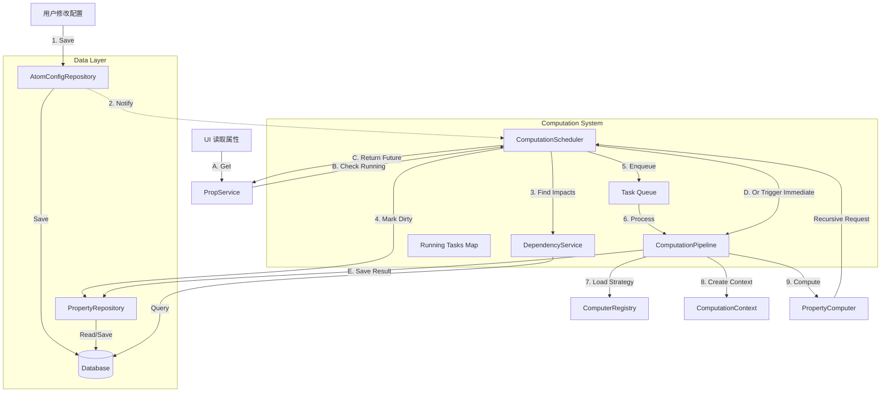

# features

- graph视图
- 定期提醒
- 待办(饮食规划, 日常事务)
- 微观流程编排(食谱, 健身动作, 番茄钟)
- 库存
- 计算(基于库存和饮食规划和食谱计算购买清单)
- 双链笔记

# ARCHITECTURE

能确定的是有一个基本block, 有一些预置模板, 用户可添加模板 

- 同步策略:  LWW


## tables

entity(insertOnly)
- id: nanoId

component(lww)
- id: nanoId
- entityId: ref(entity, id)
- type: int8
- constraintType: int8?
- allowRef: bool(true)

field(lww)
- id: nanoId
- componentId: ref(component, id)
- key: varchar(64)
- config: json?
- data: text?
- type: int8
- collectionType: int8?
- cacheDirty: bool(false)

field-ref(lww)
- src: ref(field, id)
- dst: ref(field, id)
- rank: int
- failed: bool(false)

## System

我们基本只实现基本组件, 提供组合的渠道, 让用户自行组合

### basic input

- text: 文本输入
- number: 数值, 可配类型, 可以限制范围
- status: 状态机, 可以配置状态流转
- scale: 度量, 一般是高10, 中5, 低1, 这种文字和数字常量的map
- timer: 计时器, 可以配置
- date: 日期
- image: 图片
- code: 代码块
- rich_text: 富文本

### basic render

- browser : 文件夹视图
  - list : 列表
  - grid : 表格

- document: 文档视图
  - readonly: 只读
  - editable: 可编辑

- flow : 流程视图
  - step : 每步一个大卡片
  - overview : 总览

- graph

### template

- 物质
  - name: text
  - icon(optional): image

- 食物
  - name: text
  - icon(optional): image
  - 成分(optional): list[物质, 含量]
  - 大致价格(optional)

- 库存: list[入库时间, 食物, 剩余数量/重量, 剩余过期天数, 价格]
- 饮食计划: list[date, 餐次, 多个食谱/多个食物, 数量/重量]

- 食谱
  - name: text
  - icon(optional): image
  - 配料(optional): list[食物 , 数量/重量]
  - 合成价格
  - 合成成分
  - 步骤

- 每日营养成分分析
- 每日账单
- 单个健身动作
- 健身计划
- 健身动作组合

- 部署步骤
...

# block
## id

nanoId

## type

inner
- title
- image
- richtext
- text
- reminder
- timer

## content

json

## properties

json

# property

## id

nanoId

## type

- number
- status
- aggregate
- rrule
- date


## mess

schema = entity + [components]


这份设计文档旨在重构和规范化系统中的“属性计算子系统”。

我们将采用 **异步响应式架构 (Asynchronous Reactive Architecture)**。核心理念是：**写操作非阻塞 (Fire-and-Forget)**，**读操作智能等待 (Request Coalescing)**，以及**计算任务后台排队 (Background Queuing)**。

为了提高代码可读性，我们对部分组件进行了重命名（例如将 `ValueSolver` 具象化为 `PropertyComputer`，将 `Scheduler` 职责明确化）。

---

# 属性计算系统设计文档 (Computation System Design)

## 1. 系统概览

本系统负责将用户输入的 **配置数据 (AtomConfig)** 转换为可供 UI 展示的 **属性值 (Property)**。
由于计算可能涉及复杂的节点依赖链（A依赖B，B依赖C...），为了保证 UI 流畅性，计算过程与 UI 渲染过程解耦，主要运行在后台任务队列中，但在 UI 强需时支持高优先级插队。

### 核心特性
*   **按需计算 (Lazy Evaluation)**: 只有当属性被标记为“脏 (Dirty)”且被访问或调度时才计算。
*   **依赖追踪 (Dependency Tracking)**: 自动识别上游节点变化，级联更新下游节点。
*   **读写分离**: 配置保存立即返回，计算在后台异步执行。
*   **任务合并 (Request Coalescing)**: 当多个请求同时访问同一个正在计算的属性时，共享同一个计算任务，不重复计算。

---

## 2. 架构图 (Data Flow)



---

## 3. 核心组件详解

### 3.1. `ComputationScheduler` (计算调度器)
**角色**: 系统的“大脑”与交通指挥官。单例运行。

*   **职责**:
  1.  **接收变更通知**: 监听配置变更事件。
  2.  **管理任务队列**: 维护一个待计算的 FIFO 队列 (`TaskQueue`)，负责后台预热计算。
  3.  **任务去重与合并**: 维护 `RunningTasks` (Map<Key, Future>)。如果 UI 请求一个正在计算的属性，直接返回该 Future，而不是启动新任务。
  4.  **脏标记传播**: 调用 `DependencyService` 找出受影响的下游，并在数据库中将其标记为 `Dirty`。
  5.  **提供统一读取入口**: `fetchOrSchedule(nodeId, defId)`。

### 3.2. `ComputationPipeline` (计算流水线)
**角色**: 单次计算任务的执行者。

*   **职责**:
  1.  **环境准备**: 组装 `ComputationContext`。
  2.  **策略加载**: 根据 `defId` 从注册表中找到对应的 `PropertyComputer`。
  3.  **防循环依赖**: 在递归过程中传递调用栈 (Call Stack)，检测并中断循环依赖。
  4.  **结果落地**: 执行计算，捕获异常，将结果（成功值 or 错误状态）通过 `PropertyRepository` 存入数据库。

### 3.3. `DependencyService` (依赖分析服务)
**角色**: 负责处理节点关系的查询逻辑。

*   **职责**:
  1.  **反向查找**: 给定 Node A，找出所有依赖 Node A 的 Node B, C, D...
  2.  **引用过滤 (Effect Check)**: 检查引用配置中的 `affectsValue` 标记。如果标记为 `false`（纯引用），则不将其视为受影响的下游，从而阻断无效的级联计算。

### 3.4. `ComputationContext` (计算上下文)
**角色**: 安全沙盒。`PropertyComputer` 与外界交互的唯一桥梁。

*   **职责**:
  1.  **提供输入**: 获取当前节点的 `AtomConfig`（已解码）。
  2.  **获取依赖 (Upstream Access)**: 提供 `getDependencyValue(nodeId, defId)` 接口。
  3.  **屏蔽细节**: 对计算逻辑隐藏数据库、Repo 和 Scheduler 的具体实现。
*   **实现细节**: 上下文内部会回调 `Scheduler` 或 `Pipeline` 的方法，以实现递归计算（如果依赖项也是 Dirty 的，先算依赖项）。

### 3.5. `PropertyComputer<T>` (属性计算器)
*(原名 ValueSolver)*
**角色**: 纯业务逻辑插件。

*   **职责**:
  1.  **解码**: `decodeConfig(RawConfig)` -> `ConfigObject`。
  2.  **计算**: `compute(Context, ConfigObject)` -> `Result<T>`。
  3.  **无状态**: 应当设计为纯函数或单例，不持有任何运行时状态。

---

## 4. 关键流程场景

### 场景一：用户保存配置 (Write Path)
**目标**: 快速响应 UI，后台异步更新。

1.  **UI**: 调用 `AtomConfigRepo.saveConfigs(NodeA)`。
2.  **Repo**: 写入数据库，成功后立即返回。UI 提示“保存成功”。
3.  **Repo**: 发送异步通知给 `Scheduler.onConfigChanged(NodeA)`。
4.  **Scheduler**:
  *   调用 `DependencyService` 查找 NodeA 的所有有效下游（NodeB, NodeC）。
  *   调用 `PropertyRepo` 将 NodeA, NodeB, NodeC 的 `valueStatus` 设为 `Dirty`。
  *   将 NodeA, NodeB, NodeC 加入后台 `TaskQueue`。
5.  **后台 Worker**: 从队列取出 NodeA，交给 `Pipeline` 计算并保存。随后处理 NodeB, NodeC。

### 场景二：UI 读取属性 (Read Path)
**目标**: 确保读到最新数据，如果数据过期则等待计算。

1.  **UI**: 需要显示 NodeB 的属性，调用 `PropertyService.read(NodeB)`。
2.  **Service**: 委托给 `Scheduler.fetchOrWait(NodeB)`。
3.  **Scheduler**:
  *   **Check Running**: 检查 `RunningTasks` Map。如果 NodeB 正在算（可能刚被后台队列触发），直接返回该 Future。
  *   **Check DB**: 如果没在算，查数据库。
  *   **Dirty Check**: 如果数据库里 NodeB 是 `Dirty` 状态（说明后台队列还没排到它）：
    *   **插队 (Priority Execution)**: 立即触发 `Pipeline.compute(NodeB)`。
    *   将该任务 Future 存入 `RunningTasks`。
    *   等待计算完成，返回结果。
  *   **Clean**: 如果不是 Dirty，直接返回数据库的值。

---

## 5. 数据结构调整建议

### 5.1. `PropertyConfigs` 表
增加 `affectsValue` 以支持弱引用优化。

```dart
class PropertyConfigs extends Table {
  // ...
  TextColumn get targetNodeId => text().nullable()();
  // 新增：如果为 true，上游变化会触发下游 Dirty；如果为 false，仅作为引用但不影响值计算。
  BoolColumn get affectsValue => boolean().withDefault(const Constant(true))();
}
```

### 5.2. `Properties` 表
增加 `valueStatus` 用于脏检查。

```dart
enum ValueStatus {
  normal, // 最新，可直接使用
  dirty,  // 已过期，等待重算
  error,  // 计算出错（如循环依赖）
}

class Properties extends Table {
  // ...
  // 状态列
  IntColumn get valueStatus => intEnum<ValueStatus>()();
}
```